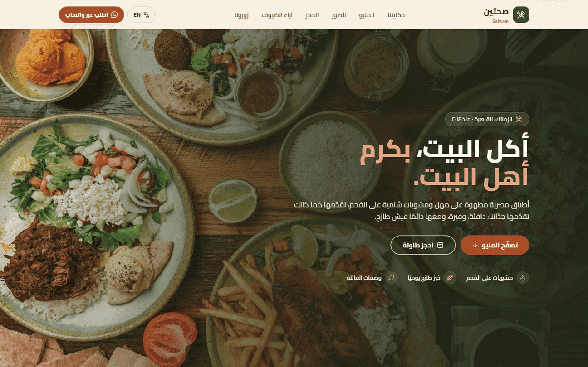
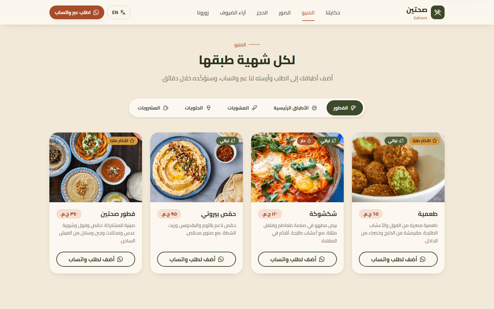
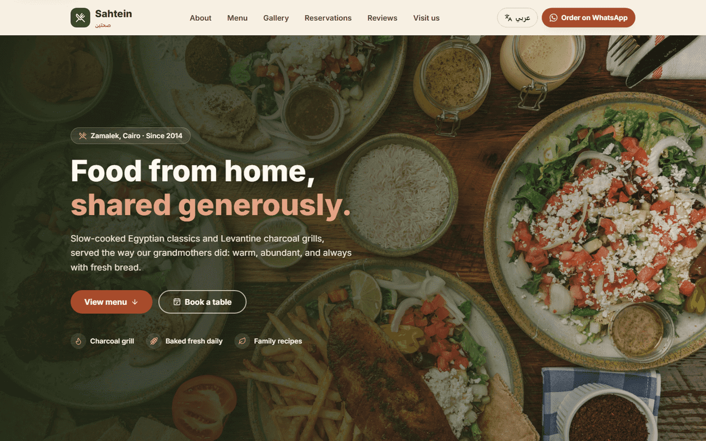
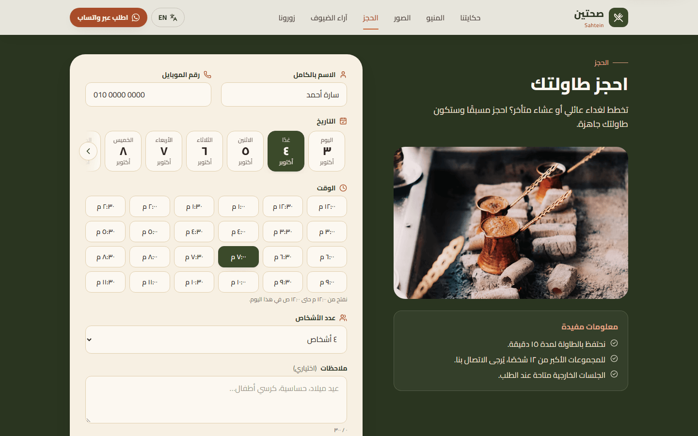
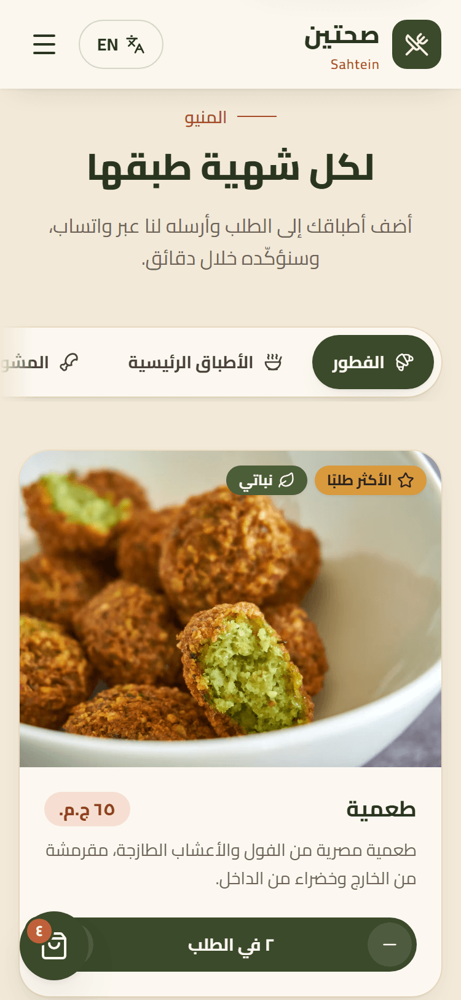

# Sahtein (صحتين): Egyptian-Levantine Restaurant

A bilingual (Arabic / English) landing page for **Sahtein**, a fictional modern Egyptian-Levantine restaurant in Zamalek, Cairo. Arabic is the default language, with a full right-to-left layout.

**[Live demo](https://sahtein-restaurant.vercel.app)**



> **Concept project.** Sahtein is a fictional restaurant built for a portfolio. The phone number, WhatsApp number, address, reviews and social links are placeholders. Food photography comes from [Unsplash](https://unsplash.com).

## Screenshots

| Menu (Arabic, RTL) | Hero (English, LTR) |
| --- | --- |
|  |  |

| Reservation form | Mobile: menu with items in the cart (375px) |
| --- | --- |
|  |  |

## Features

- **Bilingual with real RTL support**
  - AR/EN toggle saved to `localStorage`. Arabic is the default.
  - `dir` and `lang` are set on `<html>`, and an inline script applies the saved language before first paint, so the page never flashes the wrong direction.
  - Layout uses Tailwind logical properties only (`ms/me/ps/pe`, `start/end`, `text-start`). No `left`/`right` classes.
  - Directional icons are mirrored in RTL. Keyboard arrows follow reading direction in the menu tabs and the lightbox.
  - Cairo font for Arabic, Inter for English.
  - Prices, dates, times and counts are formatted with `Intl` (`ar-EG` / `en-EG`), so Arabic shows Arabic-Indic digits (١٢٠ ج.م.).
  - Arabic plural agreement is handled for item and guest counts (صنف واحد / صنفان / ٣ أصناف / ١١ صنفًا).
- **Typed translations**
  - Every string lives in `src/i18n/ar.ts` and `src/i18n/en.ts`, both typed against one `Translations` interface. A missing key is a compile error.
- **Sections:**
  - **Navbar:** sticky, with active-section highlighting, a language toggle, an "Order on WhatsApp" button, and an accessible mobile drawer (Esc to close, focus management, scroll lock).
  - **Hero:** full-width photo with two calls to action.
  - **About:** story plus 3 feature highlights.
  - **Menu:** 5 category tabs (WAI-ARIA tabs pattern) and 20 dishes with photo, description, EGP price and tags.
  - **WhatsApp order cart:**
    - Add or adjust quantities from each card.
    - A floating cart button shows the item count and total, and opens a side panel.
    - "Send order" opens `wa.me` with a pre-filled itemised message in the current language.
    - The cart is saved to `localStorage`.
  - **Gallery:** CSS-columns masonry layout with a lightbox. The lightbox has keyboard navigation, a focus trap, and returns focus to the thumbnail on close.
  - **Reservation form:**
    - Custom, fully translated date and time pickers instead of native inputs, which show English placeholders in Arabic mode:
      - Date: horizontally scrollable chips for the next 14 bookable days (Today/Tomorrow, then weekday, day and month), with Arabic-Indic digits in Arabic.
      - Time: a grid of 30-minute slots inside that day's opening hours. Friday has later hours, and slots after midnight are marked.
      - Both are WAI-ARIA radio groups: one tab stop, arrow keys that follow reading direction (ArrowLeft moves forward in RTL), and Home/End.
    - Client-side validation: Egyptian mobile numbers (Arabic-Indic digits accepted), a bookable date and slot, 1–12 guests, notes up to 300 characters.
    - Errors are linked to their fields with `aria-describedby`, and the first invalid field gets focus.
    - A success state shows a summary of the booking.
  - **Testimonials:** 3 reviews with accessible star ratings.
  - **Footer:** address, opening hours, contact links, social links and an embedded Google Map of Zamalek.
- **Motion and accessibility**
  - Scroll-in reveal animations using IntersectionObserver, plus hover lift on cards. Both respect `prefers-reduced-motion`.
  - No focus outline on mouse click. A visible `:focus-visible` ring for keyboard users.
  - A skip link.
  - Every image has alt text, lazy loading (except the hero) and explicit dimensions.

## Tech stack

- React 19 + TypeScript (strict, `noUncheckedIndexedAccess`, no `any`)
- Vite 8
- Tailwind CSS v4 (`@tailwindcss/vite`, theme tokens in `src/index.css`)
- lucide-react icons
- No router, state library or animation library

## Project structure

```
src/
  components/   Navbar, Logo, LanguageToggle, MenuCard, CartFab, CartPanel, Lightbox, Reveal, SectionHeading…
  sections/     Hero, About, Menu, Gallery, Reservation, Testimonials, Footer
  context/      Cart reducer, provider and hook
  data/         Menu, gallery, testimonials, site constants (ids, prices, image ids; no copy)
  hooks/        useInView, useActiveSection, useLockBodyScroll, useScrolled, useEscape
  i18n/         ar.ts, en.ts, LanguageProvider, useI18n
  lib/          Intl formatters, WhatsApp message builder, validation, storage, Unsplash URLs
  types/        Shared domain and translation types
```

## Getting started

```bash
npm install
npm run dev        # http://localhost:5173
npm run typecheck  # tsc -b
npm run build      # type-check + production build to dist/
npm run preview
```

## Deploying

`vercel.json` is included (Vite framework preset, `dist` output, long-lived cache headers for hashed assets). Import the repo into Vercel, or run `vercel` from the project root.

## Decisions made

- **Tailwind v4** with CSS-first `@theme` tokens instead of a `tailwind.config.js`.
- **Brand icons:** lucide-react 1.x no longer ships brand logos, so WhatsApp, Instagram, Facebook and TikTok are small inline SVG components in `src/components/icons/`. They use the official [Simple Icons](https://simpleicons.org) paths (CC0), are monochrome, and fill with `currentColor`. Every other icon is still lucide-react.
- **"Order on WhatsApp" in the navbar** opens the order panel rather than an empty chat, so visitors can review their items before sending. With an empty cart, the panel points them to the menu.
- **Translations hold all copy.** Data files hold only ids, prices and image ids, so the menu can't drift out of sync between languages.
- **Number formatting:** Arabic uses Arabic-Indic digits throughout (prices, counts, dates, the WhatsApp message). The phone input stays `dir="ltr"` and accepts both digit systems.
- **Fake contact details:**
  - WhatsApp: `+20 100 000 0000` (`wa.me/201000000000`)
  - Email: `hello@sahtein.example`
- **Map:** a keyless Google Maps embed centred on Zamalek, Cairo.
- **Photos:**
  - Real Unsplash photos, chosen by checking each candidate visually so every dish shows the right food.
  - Where Unsplash had no photo of an exact dish, the menu was adapted. Ful medames and molokhia were swapped for warak enab, lentil soup and a breakfast tray. Sugarcane juice uses a fresh-juice photo.
- **Reservation schedule** (`src/lib/schedule.ts`, constants in `src/data/site.ts`):
  - Opening hours are Saturday–Thursday 12:00–00:00 and Friday 13:00–01:00.
  - Slots run every 30 minutes, with the last seating 30 minutes before closing.
  - Same-day bookings need 60 minutes' notice. The 14-day window skips today once it has no slots left.
  - Slots after midnight are stored as `24:30`, so a Friday late table stays on the Friday booking.
  - Dates and times use the visitor's local clock.
  - At most 12 guests (larger groups are asked to call). Submission is simulated with a 700 ms delay, and there is no backend.
- **Floating cart button:**
  - Below 640px it is a compact 56px circle (icon and item-count badge only), so it covers as little of the menu cards and hero as possible. From 640px up it is a pill that also shows the total.
  - It is removed entirely (hidden from view, focus and screen readers) while the cart is empty.
  - While it is visible, the footer's bottom bar gets extra bottom padding, so at the end of the page the button sits below "Back to top". The page also gets `scroll-padding-bottom`, so anchor jumps and keyboard focus never land behind it. Checked at 375px and 1280px, in both directions.
- **Scroll fades:** the menu category tabs and the reservation date chips fade out on whichever inline edge still has more content (direction-aware for RTL). The fade disappears when everything fits. Selecting a tab scrolls it fully into view.
- **Testimonial avatars** show initials instead of stock faces: one letter in Arabic, because joined Arabic letters read as a word, and two in English.
- **Off-canvas drawers** are rendered outside the sticky header, because its `backdrop-filter` would otherwise trap fixed children. They are also clipped with `overflow-hidden`, so the off-screen panel can't cause horizontal scroll in RTL.
